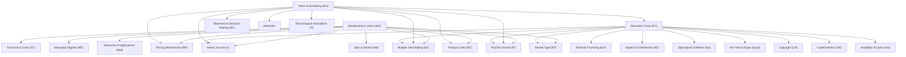

```mermaid
graph TD
  MU["Membership in Union (MU)"]
  Sch["Years of Schooling (Sch)"]
  EC["Education Costs (EC)"]

  Y["Artistic Income (Y)"]
  PM["Pricing Mechanisms (PM)"]
  MJ["Multiple Job-Holding (MJ)"]
  PI["Psychic Income (PI)"]
  TC["Transaction Costs (TC)"]
  MT["Market Type (MT)"]
  MD["Monopoly Degree (MD)"]
  App["Reduction of Applications (App)"]
  PC["Product Costs (PC)"]
  SM["Size of Market (SM)"]
  NC["Nearness to Decision-Making (NC)"]
  Net["Networks"]
  TI["Technological Innovations (TI)"]
  ExF["External Financing (ExF)"]
  SD["System of Distribution (SD)"]
  SG["Specialized Galleries (SG)"]
  Expo["Art Fairs & Expos (Expo)"]
  CR["Copyright (CR)"]
  CW["Copied Works (CW)"]
  Uns["Instability of Laws (Uns)"]

  MU --> Y
  MU --> PM
  MU --> MJ
  MU --> PI
  MU --> TC
  MU --> MT
  MU --> MD
  MU --> App
  MU --> PC
  MU --> SM

  Sch --> Y
  Sch --> MJ
  Sch --> PI
  Sch --> NC
  Sch --> Net
  Sch --> PC
  Sch --> PM
  Sch --> TI
  Sch --> EC

  EC --> Y
  EC --> MJ
  EC --> PI
  EC --> ExF
  EC --> MT
  EC --> SD
  EC --> SG
  EC --> Expo
  EC --> CR
  EC --> CW
  EC --> Uns
```
